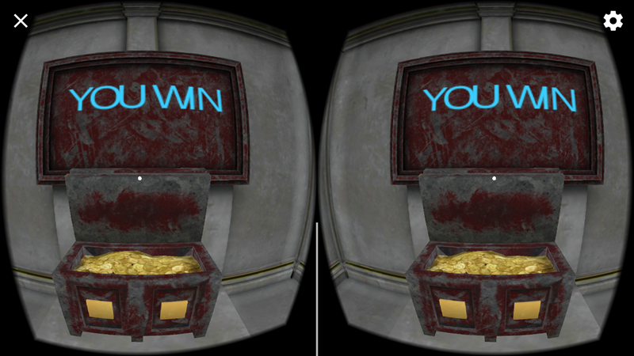

# MAZE IN VR

Build with Udacity's prefar,  
complete the project and add some custom function.

--by Zidong Lin(梓栋 林)

*****************************

### Support
* Google VR SDK for Unity version: 1.0(License:Apache 2.0)
* Submitting for Android(for 4.4 'Kit Kat', API level 19)
* Virtual Reality Supported(Virtual Reality SDKs - Cardboard/None)
* EditorVersion: Unity 5.5.1f1

*****************************

### File Directory(Integrated Project(download)：http://pan.baidu.com/s/1jIMcDOM password：6e2y)
* Assets
* Build
 - MazeVR.apk
* ProjectSettings
* ScreenShot
 - 6 Screenshot images
* README.md

*****************************
### V1.0.0 Features
1. Using the models to create a maze, which contains collectables, waypoints, a key, a door, and the completion UI.
2. Complete the script to build the function between key and the door.
3. Add some sound and particle effects to make the Experience better.
4. Rebuild the lighting map.
5. Make the Scene reload when the player click on the  final signpost.  
6. Customize function: Add 2 Text in front of the Fountain to show the number of collected coins and tells the player if the key is found.
7. Also the player is able to enter the temple and open the treasure chest. After doing this, the "Game win" SignPost will automatically appears.

